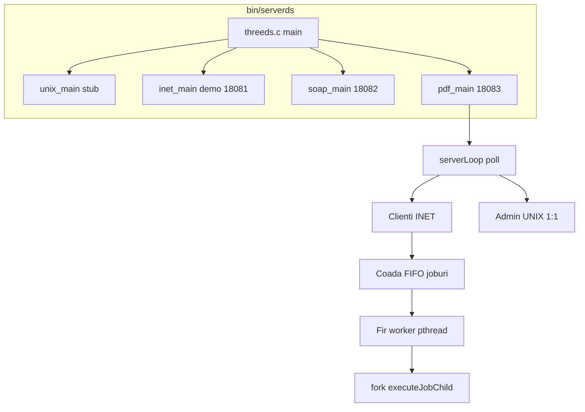

# SDD preliminar — PDFeditor (Milestone 2)

## 1. Prezentare generala

Document de proiectare software preliminar pentru arhitectura **skeleton/** a proiectului PDFeditor.

## 2. Arhitectura runtime



## 3. Structura directoare

```
skeleton/
├── include/          proto.h, pdf_ocr.h, pdf_server.h, proto_inet.h
├── src/main/         threeds.c
├── src/server/       pdfds.c, unixds.c, inetds.c, soapds.c
├── src/core/         proto.c, proto_inet.c, pdf_ocr.c
├── src/client/       pdfclient.c, pdfadmin.c, inetsample.c
├── build/obj/        obiecte compilate
├── build/generated/soap/
├── bin/              executabile
├── config/           server.cfg.example
└── data/input|output/
```

## 4. Module software

| Modul | Fisier | Responsabilitate |
|-------|--------|------------------|
| Orchestrator | `threeds.c` | Pornire 4 thread-uri, singurul `main()` |
| PDF + Admin | `pdfds.c` | `poll()`, protocol, joburi, coada, admin |
| Protocol PDF | `proto.c` | `send_all`, `recv_all`, antete |
| Protocol INET demo | `proto_inet.c` | Sample vechi port 18081 |
| OCR | `pdf_ocr.c` | Tesseract + MuPDF |
| Client IN | `pdfclient.c` | Upload, status, download |
| Client UX | `pdfadmin.c` | Meniu ncurses, comenzi admin |

## 5. Flux procesare job (REMOTE)

1. Client trimite `OPR_UPLOAD_START` (+ opParam pentru watermark)
2. Client trimite chunk-uri `OPR_UPLOAD_CHUNK`
3. Client trimite `OPR_UPLOAD_END`
4. Server pune jobul in **coada FIFO** (`enqueueJob`)
5. **Fir worker** extrage job si apeleaza `dispatchJob` → `fork` → `executeJobChild`
6. Client poll-uieste `OPR_STATUS_REQ` pana la `STATUS_JOB_DONE`
7. Client `OPR_DOWNLOAD_REQ` + chunk-uri rezultat

## 6. Flux administrare (UX)

1. `pdfadmin` conectare UNIX `/tmp/admin.sock`
2. Server accepta **un singur** admin; refuza al doilea
3. Mesaje sincrone request/response (payload: header + length + text)
4. Timeout `admin_timeout` (config) → deconectare automata

## 7. Interfete retea

| Interfata | Transport | Port / cale | Client |
|-----------|-----------|-------------|--------|
| PDF IN | TCP INET | 18083 | pdfclient |
| Admin UX | UNIX stream | `/tmp/admin.sock` | pdfadmin |
| INET demo | TCP | 18081 | inetclient |
| SOAP | TCP | 18082 | soap-sample |

## 8. Persistenta

- Fisiere upload: `data/input/{jobId}_{filename}`
- Rezultate: `data/output/result_{jobId}.txt`
- Config: `config/server.cfg` (libconfig, optional)
- Istoric joburi: in-memory `gJobHistory[]` (max 512)

## 9. Constrangeri si decizii

| Decizie | Motivatie |
|---------|-----------|
| `fork` per job | Izolare crash-uri MuPDF/OCR |
| Coada FIFO + worker | Cerinta milestone (puncte) |
| Admin pe acelasi `poll` loop | Simplitate M2; thread dedicat admin poate fi M3 |
| Watermark ca text banner | M2 fara rescriere PDF completa |
| GDPR blur pe text extras | Redactare @email si secvente numerice lungi |

## 10. Build si deploy

```bash
cd skeleton
make soap   # prima data
make all
./bin/serverds [-c config/server.cfg]
```

## 11. Revizii

| Versiune | Data | Autor | Note |
|----------|------|-------|------|
| 0.1-draft | M2 | Echipa | SDD preliminar pentru milestone |
